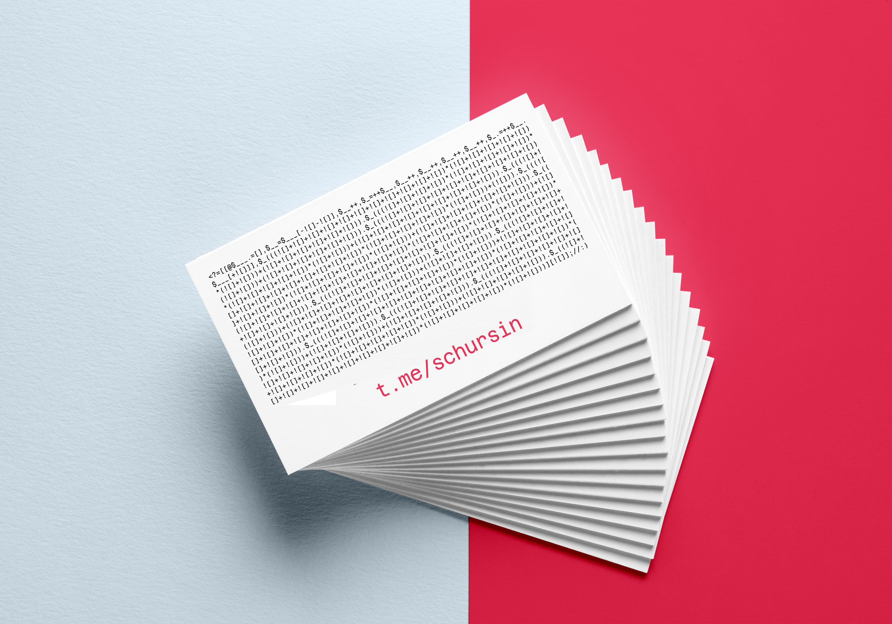

# PHP JAPH

[](https://www.php.net) [](https://ru.wikipedia.org/wiki/JAPH)

> JAPH (англ. Just Another Perl Hacker) — короткая программа на Perl, выводящая строчку Just Another Perl Hacker, (с англ. — «Просто ещё один Perl хакер,»; запятая в конце не обязательна). JAPH являются классическим примером трудночитаемого кода в угоду эффективности (или даже эффектности) программы. Также, JAPH приводится в качестве демонстрации гибкости и возможностей языка Perl.

### Не все пятницы одинаково бесполезны.

Пятница. Офис. За окном 29 декабря. Отдел разработки компании N бурно что-то обсуждает. На экране одного из разработчиков один за другим появляются отрывки кода на языке Perl; что примечательно, выглядят они как ASCII-арт, но работают — запускаются и выводят на экран строку "Just Another Perl Hacker". Как? Почему? Зачем? «Это JAPH» — говорит один из коллег — «на PHP такое не получится, оно даже и к лучшему».

### А что если... задача!

Необходимо всеми правдами и неправдами написать JAPH на PHP, учитывая несколько пожеланий «из зала»:

- Код должен выполняться на свежих версиях PHP (остановимся на 7.4, 8.0, 8.1, 8.2, 8.3) без ошибок и предупреждений.
- Код должен быть максимально компактным, условно: «чтобы можно было напечатать хоть на визитке».
- В коде не должны встречаться ни буквы, ни цифры — совсем, ни одной.
- Выводимая строка может меняться: "Just Another Perl Hacker" не константа от слова совсем, нужен универсальный код.

### Начну, пожалуй.

Чтобы выводить на экран буквы, мне нужны буквы (— спасибо, кэп!). Однако, условия задачи в этом несколько ограничивают — букв у меня нет, точнее мне нельзя их использовать в коде. Не беда, есть функция [`chr()`](https://www.php.net/manual/ru/function.chr.php), но вместе с ней появляются два вопроса:

- Как передать в `chr()` код символа, если цифры использовать нельзя?
- Как вызвать `chr()`, если буквы использовать нельзя?

Попробуем пофантазировать на тему приведения типов:

```php
<?php

var_dump(+![]); // int(1)
var_dump(-![]); // int(-1)
```

Неплохо, похоже, что первый вопрос закрыт — есть «цифры без цифр». Продолжаю вспоминать и использовать особенности приведения типов и работы со строками:

```php
<?php

@$arrayWord .= []; // string(5) "Array"

$letter = $arrayWord[-![]-![]]; // $arrayWord[-2] => string(1) "a"
$letter++; // string(1) "b"
$chr = ++$letter; // string(1) "c"
$letter++; // string(1) "d"
$letter++; // string(1) "e"
$letter++; // string(1) "f"
$letter++; // string(1) "g"
$chr .= ++$letter /* string(1) "h" */ . $arrayWord[+![]] /* string(1) "r" */; // string(3) "chr"

// в переменной $chr строка "chr", можем пользоваться ей как функцией
echo $chr(![]); // выводит символ с кодом 1
```

Несколько минут страха и второй вопрос тоже закрыт — вызвать `chr()` можно. Выходит, оба вопроса закрыл, однако, появились еще два — ничья:

- В коде есть `echo` — это противоречит условиям задачи.
- Имена переменных содержат буквы — это, опять же, противоречит условиям задачи.

Импровизирую дальше:

```php
<?= // вывод на экран, echo больше не нужен
[
    /**
     * [0] элемент массива, размещаю здесь весь вспомогательный код
     */

    [
       @$___ .= [],              // @$arrayWord .= [];
        $__ = $___[-![]-![]],    // $letter = $arrayWord[-![]-![]];
        $__++,                   // $letter++;
        $_ = ++$__,              // $chr = ++$letter;
        $__++,                   // $letter++;
        $__++,                   // $letter++;
        $__++,                   // $letter++;
        $__++,                   // $letter++;
        $_ .= ++$__ . $___[+![]] // $chr .= ++$letter . $arrayWord[+![]];
    ],
    
    /**
     * [1] элемент массива, собираю строку из символов
     */

    // "t" = chr(116) = (11 * 5 * 2) + 6
    $_(((![]+![]+![]+![]+![]+![]+![]+![]+![]+![]+![])*(![]+![]+![]+![]+![])*(![]+![]))+(![]+![]+![]+![]+![]+![])) .
    
    // "." = chr(46) = (4 * 5 * 2) + 6
    $_(((![]+![]+![]+![])*(![]+![]+![]+![]+![])*(![]+![]))+(![]+![]+![]+![]+![]+![])) .
    
    // "m" = chr(109) = (10 * 5 * 2) + 9
    $_(((![]+![]+![]+![]+![]+![]+![]+![]+![]+![])*(![]+![]+![]+![]+![])*(![]+![]))+(![]+![]+![]+![]+![]+![]+![]+![]+![])) .
    
    // "e" = chr(101) = (10 * 5 * 2) + 1
    $_(((![]+![]+![]+![]+![]+![]+![]+![]+![]+![])*(![]+![]+![]+![]+![])*(![]+![]))+(![])) .
    
    // "/" = chr(47) = (4 * 5 * 2) + 7
    $_(((![]+![]+![]+![])*(![]+![]+![]+![]+![])*(![]+![]))+(![]+![]+![]+![]+![]+![]+![])) .
    
    // "s" = chr(115) = (11 * 5 * 2) + 5
    $_(((![]+![]+![]+![]+![]+![]+![]+![]+![]+![]+![])*(![]+![]+![]+![]+![])*(![]+![]))+(![]+![]+![]+![]+![])) .
    
    // "c" = chr(99) = (9 * 5 * 2) + 9
    $_(((![]+![]+![]+![]+![]+![]+![]+![]+![])*(![]+![]+![]+![]+![])*(![]+![]))+(![]+![]+![]+![]+![]+![]+![]+![]+![])) .
    
    // "h" = chr(104) = (10 * 5 * 2) + 4
    $_(((![]+![]+![]+![]+![]+![]+![]+![]+![]+![])*(![]+![]+![]+![]+![])*(![]+![]))+(![]+![]+![]+![])) .
    
    // "u" = chr(117) = (11 * 5 * 2) + 7
    $_(((![]+![]+![]+![]+![]+![]+![]+![]+![]+![]+![])*(![]+![]+![]+![]+![])*(![]+![]))+(![]+![]+![]+![]+![]+![]+![])) .
    
    // "r" = chr(114) = (11 * 5 * 2) + 4
    $_(((![]+![]+![]+![]+![]+![]+![]+![]+![]+![]+![])*(![]+![]+![]+![]+![])*(![]+![]))+(![]+![]+![]+![])) .
    
    // "s" = chr(115) = (11 * 5 * 2) + 5
    $_(((![]+![]+![]+![]+![]+![]+![]+![]+![]+![]+![])*(![]+![]+![]+![]+![])*(![]+![]))+(![]+![]+![]+![]+![])) .
    
    // "i" = chr(105) = (10 * 5 * 2) + 5
    $_(((![]+![]+![]+![]+![]+![]+![]+![]+![]+![])*(![]+![]+![]+![]+![])*(![]+![]))+(![]+![]+![]+![]+![])) .
    
    // "n" = chr(110) = 11 * 5 * 2
    $_((![]+![]+![]+![]+![]+![]+![]+![]+![]+![]+![])*(![]+![]+![]+![]+![])*(![]+![]))
]
[![]]; // выводим [1] элемент массива
```

### 3... 2... 1... Поехали!

```sh
>> php japh.php
<< t.me/schursin
```

Забавно, скромная улыбка.

### Что на счёт компактности?

Безжалостно удаляю все комментарии и пробелы:

```php
<?=[[@$___.=[],$__=$___[-![]-![]],$__++,$_=++$__,$__++,$__++,$__++,$__++,$_.=++$__.
$___[+![]]],$_(((![]+![]+![]+![]+![]+![]+![]+![]+![]+![]+![])*(![]+![]+![]+![]+![])
*(![]+![]))+(![]+![]+![]+![]+![]+![])).$_(((![]+![]+![]+![])*(![]+![]+![]+![]+![])*
(![]+![]))+(![]+![]+![]+![]+![]+![])).$_(((![]+![]+![]+![]+![]+![]+![]+![]+![]+![])
*(![]+![]+![]+![]+![])*(![]+![]))+(![]+![]+![]+![]+![]+![]+![]+![]+![])).$_(((![]+!
[]+![]+![]+![]+![]+![]+![]+![]+![])*(![]+![]+![]+![]+![])*(![]+![]))+(![])).$_(((![
]+![]+![]+![])*(![]+![]+![]+![]+![])*(![]+![]))+(![]+![]+![]+![]+![]+![]+![])).$_((
(![]+![]+![]+![]+![]+![]+![]+![]+![]+![]+![])*(![]+![]+![]+![]+![])*(![]+![]))+(![]
+![]+![]+![]+![])).$_(((![]+![]+![]+![]+![]+![]+![]+![]+![])*(![]+![]+![]+![]+![])*
(![]+![]))+(![]+![]+![]+![]+![]+![]+![]+![]+![])).$_(((![]+![]+![]+![]+![]+![]+![]+
![]+![]+![])*(![]+![]+![]+![]+![])*(![]+![]))+(![]+![]+![]+![])).$_(((![]+![]+![]+!
[]+![]+![]+![]+![]+![]+![]+![])*(![]+![]+![]+![]+![])*(![]+![]))+(![]+![]+![]+![]+!
[]+![]+![])).$_(((![]+![]+![]+![]+![]+![]+![]+![]+![]+![]+![])*(![]+![]+![]+![]+![]
)*(![]+![]))+(![]+![]+![]+![])).$_(((![]+![]+![]+![]+![]+![]+![]+![]+![]+![]+![])*(
![]+![]+![]+![]+![])*(![]+![]))+(![]+![]+![]+![]+![])).$_(((![]+![]+![]+![]+![]+![]
+![]+![]+![]+![])*(![]+![]+![]+![]+![])*(![]+![]))+(![]+![]+![]+![]+![])).$_((![]+!
[]+![]+![]+![]+![]+![]+![]+![]+![]+![])*(![]+![]+![]+![]+![])*(![]+![]))][![]];//:)
```

Нахожу шаблон визитки (это конечно была шутка в условиях, но мне не жалко, даже интересно), примеряю:



### Можно отдавать в тираж ;)
